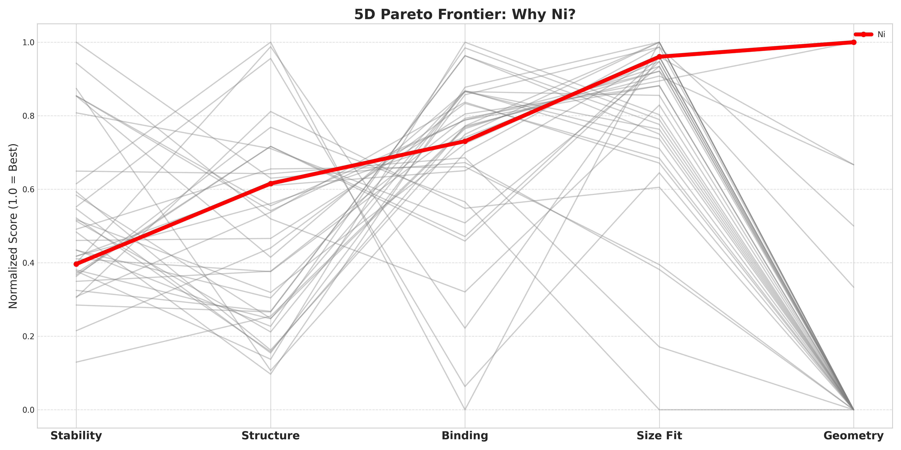
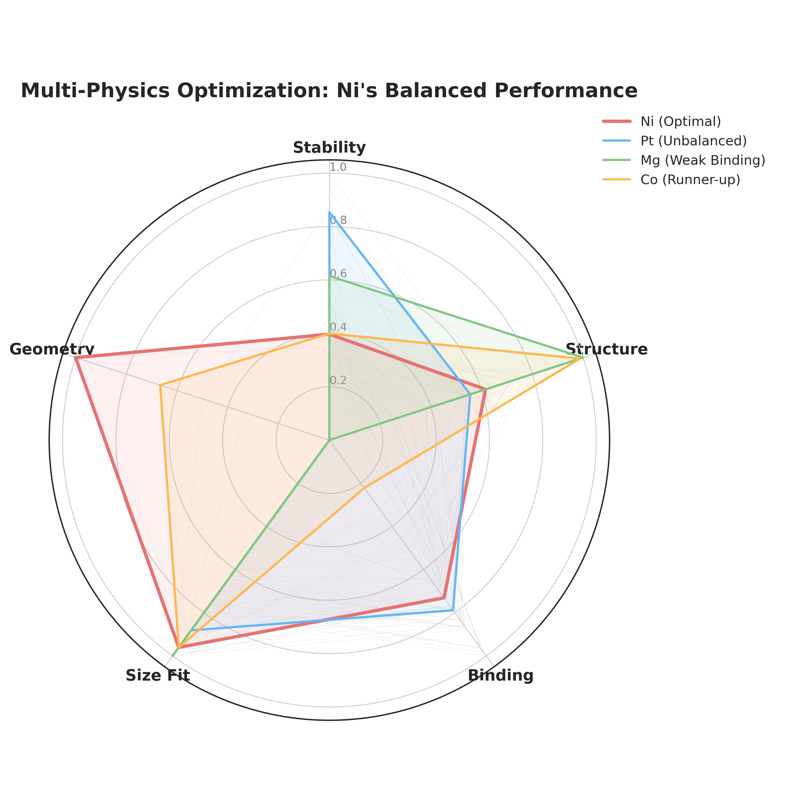

# Ni-Whitlockite: Computational Screening (MD -> AI -> DFT)

[](#pipeline)
[](#3-aiml-52-element-screening)
[](#2-md-screening-21-metals)
[](#4-dft-verification)
[](#citation)

The **computational pipeline** behind the manuscript *"Unveiling the Superiority of Ni-Whitlockite"* is a multi-scale screening workflow (molecular dynamics -> machine learning -> DFT) that identifies **nickel (Ni)** as the optimal metal substituent for high-hardness metal-substituted **whitlockite**, a bone-graft biomaterial.

> **Scientific question.** Which substituent M gives the best reinforcement profile in metal-substituted whitlockite?
> **Hypothesis.** A d8 transition metal (Ni) maximizes strength through crystal-field stabilization energy (CFSE) and a structurally distorted lattice.

*This repository contains the computational/ML pipeline, data, and result figures only. Experimental characterization (XRD / XPS / FTIR / nanoindentation) is reported in the manuscript and its Supporting Information.*

---

## Pipeline

```text
Stage 1  MD screening (21 metals, GROMACS)             -> MSD, RDF, PMF, Lindemann, CN
Stage 2  AI prediction (52 candidate elements, XGBoost)-> 5D Utopia ranking: 52 -> Top-12 -> 1 (Ni)
Stage 3  DFT verification (Quantum ESPRESSO + LOBSTER) -> CFSE / electronic origin
```

## 2. MD screening (21 metals)

Large-scale GROMACS MD of 21 metal substituents at the M5 Wyckoff 6b site. Per-metal descriptors include **MSD** (dynamic stability), **RDF**, **PMF depth** (M-O binding), **Lindemann index**, and **CN_mean / CN_std** (local structural rigidity).

- Ni shows the **lowest potential energy among screened divalent transition-metal candidates** and a deep PMF well (-14.25 kJ/mol).
- Data: `data/md_potential_energy_21metals.csv`, `data/spatial_heterogeneity_21metals.csv`, `data/md_timepoint_scores_21metals.csv`, `data/pmf_results.csv`.

## 3. AI/ML 52-element screening

**XGBoost** gradient-boosted-tree regressors (Chen & Guestrin, 2016) trained on the 21-metal MD data predict MSD / Lindemann / PMF for **52 candidate elements**, followed by **5D multi-objective ranking**:

| axis | descriptor | objective |
|---|---|---|
| Stability | MSD | min |
| Structure | Lindemann | min |
| Binding | PMF | min (deeper) |
| Size fit | radius mismatch | min |
| Geometry | OSSE (octahedral site stabilization) | max |

The raw 5D Pareto frontier is broad: the XGBoost pipeline writes `outputs/pareto_5d_xgboost.csv`, where **38 metals are non-dominated** and the added `Dist` / `Rank` columns give Utopia-distance ordering. The manuscript-facing **Top-12 is the Utopia-distance Tier-1 selection**, not the full raw non-dominated set.

The authoritative ranking is `data/final_ranking_5d.csv`, which matches the XGBoost script output `outputs/pareto_5d_xgboost.csv`. Its Top-12 is:

`Ni, Cr, V, Co, Cu, W, Eu, Ho, Dy, Tb, Tc, Au`

Ni is **Rank #1**, and the leading 3d-metal Top-5 is **Ni, Cr, V, Co, Cu**. The XGBoost script `src/run_5d_pareto_xgboost.py` reproduces this ranking exactly.

The Top-12 period distribution is period 4 (3d) = Ni, Cr, V, Co, Cu (5); period 5 (4d) = Tc (1); period 6 (5d/4f) = W, Eu, Ho, Dy, Tb, Au (6).

Scientific disposition of the non-Ni Tier-1 candidates:

| candidate(s) | disposition |
|---|---|
| Cr, V, Co, Cu | Viable 3d M2+ candidates, but rank below Ni by Utopia distance. |
| W | High-valence W(+6) chemistry creates charge imbalance in the divalent substitution site. |
| Eu, Tb, Ho, Dy | Rare-earth +3 substitution weakens the lattice through charge-compensating defects. |
| Tc | Radioactive; not viable for a biomaterial. |
| Au | Noble-metal redox favors reduction to Au(0) rather than stable M2+ substitution. |

After Utopia-distance ranking and chemistry filtering, the winner is **Ni**.

The separate hardness model uses n = 4 experimental hardness entries (Mg/Co/Ni/Cu). The robust reported claims, **CFSE-dominant importance = 0.96** and predicted ranking **Ni > Co > Mg > Cu**, come from the full-fit XGBoost model saved in `outputs/hardness_fullfit_importance_xgboost.csv`. The leave-one-out file `outputs/loocv_hardness_xgboost.csv` is retained as a transparent small-n diagnostic: with n = 4, its per-fold point predictions are statistically limited, its per-fold CFSE importance is approximately zero, and it should not be cited as evidence for CFSE dominance or ranking reproduction.

|  |  |
|:--:|:--:|
| 5D Pareto / Utopia-distance selection (Ni highlighted) | 5D radar: why Ni |

## 4. DFT verification

Quantum ESPRESSO (PBE+U) + LOBSTER calculations address the electronic origin (CFSE / COHP). Ni's near-degenerate high/low-spin states cause charge sloshing and spin frustration, resolved with a 42-atom primitive cell and a two-step protocol (`nspin=1` relaxation -> `nspin=2` energy). See `docs/DFT_convergence_criteria.md`.

---

## Reproduce the ML

```bash
pip install -r requirements.txt
python src/run_5d_pareto_xgboost.py
python src/run_loocv_hardness_xgboost.py
```

## Reproducibility & provenance

- `src/run_5d_pareto_xgboost.py` reads the MD descriptor CSVs in `data/` and writes `outputs/pareto_5d_xgboost.csv` with Pareto membership plus Utopia-distance `Dist` / `Rank` columns.
- `src/run_loocv_hardness_xgboost.py` writes `outputs/loocv_hardness_xgboost.csv` and the full-fit feature-importance file `outputs/hardness_fullfit_importance_xgboost.csv`.
- `data/final_ranking_5d.csv` is the authoritative XGBoost ranking used for the manuscript-facing Top-12 Utopia-distance selection.
- `data/ai_prediction_raw_45elements.csv` is a historical filename; the file contains 52 candidate elements.

## Repository structure

```text
src/        XGBoost ML pipeline (5D Pareto, LOOCV and full-fit hardness)
data/       MD descriptors (21 metals), 52-element predictions, rankings, hardness (n=4)
figures/    5D Pareto / radar / scree-plot result figures
docs/       AI analysis & validation, DFT convergence, Pareto survivor analysis, data dictionary
outputs/    reproduced result CSVs
```

## Authors & Contributors

- **Jung Heon Lee** - [@juhelee7](https://github.com/juhelee7) - supervision, corresponding author
- **Jina Bae** - [@jinjin-del](https://github.com/jinjin-del) - experiments (synthesis & characterization)
- **Byoungsang Lee** - [@carryer123](https://github.com/carryer123) - MD / DFT / ML computation (this repo)

See [`CONTRIBUTORS.md`](CONTRIBUTORS.md).

## Software

GROMACS 2023.3; Quantum ESPRESSO 7.3.1; LOBSTER 5.1.0; XGBoost; scikit-learn; NumPy; pandas; matplotlib.

## Citation

Manuscript: *"Unveiling the Superiority of Ni-Whitlockite"* (submitted to **Advanced Materials**).
ML method: Chen, T. & Guestrin, C. *XGBoost: A Scalable Tree Boosting System.* KDD 2016.
